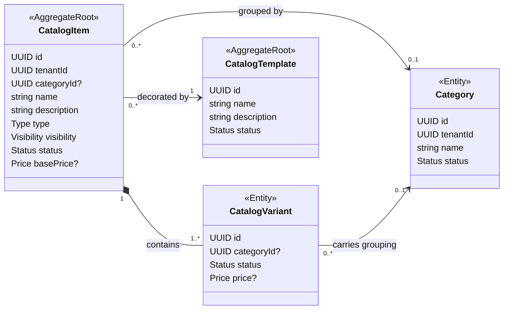

# Catalog Service

The Catalog Service is responsible for managing the product catalog of the OmniCore platform. It provides a multi-tenant, template-driven model for defining, organizing, and projecting commercial and internal product offerings.

This service is part of the [OmniCore](../README.md) portfolio project.

---

## Responsibilities

- Manage **CatalogItems** — the canonical representation of a product within a tenant's catalog.
- Manage **CatalogVariants** — the projected unit of a catalog item (the entity that consumers and downstream systems interact with).
- Manage **Categories** — tenant-scoped groupings for catalog items and variants.
- Manage **CatalogTemplates** — global, Omnicore-managed structural templates that tenants can select when creating catalog items.
- Expose **Catalog and Menu projections** — runtime read views derived from items, variants, and templates. These are not persisted entities.
- Support **multi-tenancy** at the data level: all tenant-scoped entities are isolated by `tenantId`.

### What this service does NOT do

- It does not manage pricing engines or discount rules.
- It does not manage orders, inventory levels, or stock.
- It does not own authentication or tenant provisioning.

---

## Technology Stack

| Concern | Choice |
|---|---|
| Language | C# |
| Runtime | .NET 9 |
| API transport | REST (ASP.NET Core) — gRPC planned |
| Architecture | Hexagonal (Ports & Adapters) |
| Persistence | In-memory (current phase) — SQL planned |
| Containerization | Docker (Alpine SDK image) |
| Local orchestration | Tilt + Docker Compose |

### Why .NET 9?

The Catalog Service is a deliberate exercise in enterprise-grade C# architecture. .NET 9 was chosen to:

- Explore **Hexagonal Architecture** and **Domain-Driven Design** patterns in a statically typed, production-grade ecosystem.
- Practice clean separation between domain logic and infrastructure concerns without relying on ORM leakage into the domain layer.
- Leverage the **transport-agnostic** design enabled by ASP.NET Core — the same use case handlers will serve REST, gRPC, and queue-based consumers without modification.
- Demonstrate that .NET is a strong choice for modular, testable, contract-driven backend services.

---

## Architecture

This service follows **Hexagonal Architecture (Ports & Adapters)**. The domain and application core are fully decoupled from transport (HTTP, gRPC) and infrastructure (database, cache) concerns.

```
┌─────────────────────────────────────────────────────────┐
│                        Api Layer                        │
│   Controllers (REST)  ·  gRPC Services  ·  Consumers    │
│              (Inbound Adapters)                         │
└────────────────────────┬────────────────────────────────┘
                         │ IUseCasePort (inbound)
┌────────────────────────▼────────────────────────────────┐
│                   Application Layer                     │
│         Use Cases · DTOs · Inbound/Outbound Ports       │
└────────────────────────┬────────────────────────────────┘
                         │ IRepositoryPort (outbound)
┌────────────────────────▼────────────────────────────────┐
│                  Infrastructure Layer                   │
│       Repositories · DB Clients · External Services     │
│              (Outbound Adapters)                        │
└─────────────────────────────────────────────────────────┘
         ▲ depends on Domain types only
┌────────────────────────────────────────────────────────┐
│                     Domain Layer                       │
│  Aggregates · Entities · Value Objects · Enumerations  │
│           No framework dependencies                    │
└────────────────────────────────────────────────────────┘
```

**Dependency rule:** inner layers (Domain, Application) have zero knowledge of outer layers. Transport and infrastructure details never leak into business logic.

---

## Domain Model

The domain is centered around `CatalogItem` as the primary aggregate root. `CatalogVariant` is the universal projected unit — the entity that downstream systems (menus, POS, storefront) consume.



**Key invariants:**
- Every `CatalogItem` has at least one `CatalogVariant` (auto-generated).
- `CatalogTemplate` is global (not tenant-scoped), managed by Omnicore, and exposes read metadata plus attribute definitions in MVP 1.
- `CatalogItem.TemplateId` is required, immutable, and must point to an active global template when the item is created.
- Item and variant attributes are explicit values validated against the selected template definitions.
- `CatalogItem`, `CatalogVariant`, `Option`, and `Category` are tenant-scoped.
- `CatalogItem.CategoryId` is optional. When present on create, it must point to an active category from the same tenant.
- `Catalog` and `Menu` are **runtime projections** — they are computed on read and are never persisted.

Full domain diagram: [`docs/diagrams/domain.mmd`](./docs/diagrams/domain.mmd)

---

## Project Structure

```
catalog-service/
├── src/
│   ├── CatalogService.Domain/              # Aggregates, entities, value objects, enums
│   │   ├── CatalogItems/                   # CatalogItem (AR), CatalogVariant, Option...
│   │   ├── CatalogTemplates/               # CatalogTemplate (AR), AttributeDefinition
│   │   ├── Categories/                     # Category
│   │   ├── Common/                         # Price, shared enums, domain exceptions
│   │   └── Projections/                    # ICatalogProjection, IMenuProjection
│   │
│   ├── CatalogService.Application/         # Use cases, ports, DTOs
│   │   ├── DTOs/                           # Data transfer objects (Application-owned)
│   │   ├── Ports/
│   │   │   ├── Inbound/                    # Use case interfaces (IGetCatalogItemsUseCase...)
│   │   │   └── Outbound/                   # Repository/service interfaces (ICatalogItemRepository...)
│   │   ├── UseCases/                       # Use case implementations (handlers)
│   │   └── ServiceCollectionExtensions.cs  # DI registration for this layer
│   │
│   ├── CatalogService.Infrastructure/      # Outbound adapters
│   │   ├── Repositories/
│   │   │   └── in-memory/                  # Current: InMemoryCatalogItemRepository
│   │   └── ServiceCollectionExtensions.cs  # DI registration for this layer
│   │
│   └── CatalogService.Api/                 # Entry point, inbound adapters
│       ├── Controllers/                    # REST controllers
│       ├── Program.cs                      # Composition root
│       ├── appsettings.json
│       └── appsettings.Development.json
│
├── tests/
│   ├── CatalogService.Domain.Tests/
│   └── CatalogService.Application.Tests/
│
├── docs/
│   ├── notion.md                           # Links to Notion planning pages
│   ├── testing.md                          # Test strategy, local verification, CI notes
│   └── diagrams/
│       ├── domain.mmd                      # Domain model (Mermaid)
│       └── use-cases.mmd                   # Use case diagram (Mermaid)
│
├── docker-compose.dev.yml                  # Local dev container
├── Tiltfile                                # Tilt configuration for this service
└── CatalogService.sln
```

---

## Getting Started

### Option A — Local with .NET CLI (no Docker)

**Prerequisites:** [.NET 9 SDK](https://dotnet.microsoft.com/download/dotnet/9.0)

```bash
cd src/CatalogService.Api
dotnet run
```

With hot reload:

```bash
dotnet watch run --project src/CatalogService.Api/CatalogService.Api.csproj --no-launch-profile
```

The API will be available at `http://localhost:5080`.

### Option B — Docker via Tilt (recommended)

**Prerequisites:** [Docker Desktop](https://www.docker.com/products/docker-desktop/), [Tilt](https://docs.tilt.dev/install.html)

```bash
# From the OmniCore root
tilt up

# Or to run only this service
tilt up catalog-api
```

The Tilt dashboard is available at `http://localhost:10350`.

### Option C — Docker Compose directly

```bash
cd catalog-service
docker-compose -f docker-compose.dev.yml up
```

---

## API

The service currently exposes a REST API via ASP.NET Core Controllers.

| Method | Path | Required Headers | Description |
|---|---|---|
| `GET` | `/api/v1/catalog-templates` | None | Returns all global catalog templates |
| `GET` | `/api/v1/catalog-templates/{id}` | None | Returns one global catalog template by id |
| `GET` | `/api/v1/projections/catalog` | `X-Tenant-Id: {uuid}` | Returns the runtime catalog projection grouped by category |
| `GET` | `/api/v1/catalog-items` | `X-Tenant-Id: {uuid}` | Returns all catalog items for a tenant |
| `GET` | `/api/v1/catalog-items/{id}` | `X-Tenant-Id: {uuid}` | Returns the administrative detail for one catalog item, including its variants |
| `POST` | `/api/v1/catalog-items` | `X-Tenant-Id: {uuid}` | Creates a catalog item for a tenant |
| `POST` | `/api/v1/catalog-items/{itemId}/variants` | `X-Tenant-Id: {uuid}` | Adds a variant to an existing catalog item |
| `PATCH` | `/api/v1/catalog-items/{itemId}/variants/{variantId}` | `X-Tenant-Id: {uuid}` | Updates variant name, description, status and optional price |
| `DELETE` | `/api/v1/catalog-items/{itemId}/variants/{variantId}` | `X-Tenant-Id: {uuid}` | Deactivates a variant |
| `GET` | `/api/v1/categories` | `X-Tenant-Id: {uuid}` | Returns active categories for a tenant |
| `POST` | `/api/v1/categories` | `X-Tenant-Id: {uuid}` | Creates a tenant-scoped category |
| `PATCH` | `/api/v1/categories/{id}` | `X-Tenant-Id: {uuid}` | Updates a category name and/or status |
| `DELETE` | `/api/v1/categories/{id}` | `X-Tenant-Id: {uuid}` | Deactivates a category |

`GET /api/v1/catalog-items/{id}` is an administrative view of the `CatalogItem`
aggregate. Public catalog/menu projections should consume `CatalogVariant` as the
primary read unit instead of treating `CatalogItem` as the public-facing resource.

**Swagger / OpenAPI** (Development only):
```
GET http://localhost:5080/swagger
GET http://localhost:5080/swagger/v1/swagger.json
```

### Planned transports

- **gRPC** — same use cases, Protocol Buffers contract, served on the same host via HTTP/2.
- **Message queue consumer** — async ingestion for catalog update events.

The transport-agnostic design ensures that adding a new transport requires no changes to Application or Domain layers.

---

## Environment & Configuration

### Current phase (in-memory)

No external dependencies or secrets are required. The service runs fully in-memory with seed data.

| Variable | Default | Description |
|---|---|---|
| `ASPNETCORE_ENVIRONMENT` | `Development` | Controls environment-specific behavior |
| `ASPNETCORE_URLS` | `http://+:8080` | Binding address inside the container |

### Tenant context
Tenant-scoped endpoints require the `X-Tenant-Id` header with a valid UUID.
- Missing or empty header → `400` with `application/problem+json`
- Valid tenant with no data → `200` with `[]`
- Valid tenant with data → `200` with JSON array
Example:

```bash
curl -H "X-Tenant-Id: aaaaaaaa-0000-0000-0000-000000000001" \
http://localhost:5080/api/v1/catalog-items
```

Administrative item detail:

```bash
curl -H "X-Tenant-Id: aaaaaaaa-0000-0000-0000-000000000001" \
http://localhost:5080/api/v1/catalog-items/aaaaaaaa-0000-0000-0000-000000000001
```

Detail behavior:
- Existing item in the tenant -> `200` with item fields and `variants`.
- Unknown item -> `404` with `application/problem+json`.
- Item belonging to another tenant -> `404` with `application/problem+json`.
- Empty item id -> `400` with `application/problem+json`.

Global catalog template discovery:

```bash
curl http://localhost:5080/api/v1/catalog-templates

curl http://localhost:5080/api/v1/catalog-templates/bbbbbbbb-0000-0000-0000-000000000001
```

Template behavior:
- Catalog template endpoints are global and do not require `X-Tenant-Id`.
- `GET /api/v1/catalog-templates` returns all templates, including inactive templates, with explicit `status`.
- `GET /api/v1/catalog-templates/{id}` returns `404` with `CAT-APP-010` when the template does not exist.
- Template responses do not include `tenantId`, but they do include global Omnicore-managed attribute definitions.

Runtime catalog projection:

```bash
curl -H "X-Tenant-Id: aaaaaaaa-0000-0000-0000-000000000001" \
  http://localhost:5080/api/v1/projections/catalog
```

Projection behavior:
- The projection is generated at read time and is not persisted.
- It includes active commercial items, active variants, active categories, and a virtual `uncategorized` category.
- Projected items are variant-first and enriched with item, category, price, template, and resolved attribute data.
- Attribute values resolve with `variant > item > template default`.
- The response is not paginated in MVP 1.

Administrative item creation:

```bash
curl -X POST http://localhost:5080/api/v1/catalog-items \
  -H "Content-Type: application/json" \
  -H "X-Tenant-Id: aaaaaaaa-0000-0000-0000-000000000001" \
  -d '{
    "name": "Producto nuevo",
    "tenantId": "aaaaaaaa-0000-0000-0000-000000000001",
    "description": "Algo nuevo",
    "type": "simple",
    "visibility": "commercial",
    "status": "active",
    "templateId": "bbbbbbbb-0000-0000-0000-000000000001",
    "categoryId": "aaaaaaaa-0000-0000-0000-000000000001",
    "attributes": [
      { "key": "spicy", "value": "false" }
    ]
  }'
```

Creation behavior:
- A valid item -> `201` with the created item and its default variant.
- `templateId` is required and must point to an active global template.
- `categoryId` is optional.
- A provided `categoryId` must belong to the current tenant and be active.
- Unknown or other-tenant category -> `404` with `CAT-APP-004`.
- Inactive category -> `400` with `CAT-APP-007`.

Administrative category management:

```bash
curl -X POST http://localhost:5080/api/v1/categories \
  -H "Content-Type: application/json" \
  -H "X-Tenant-Id: aaaaaaaa-0000-0000-0000-000000000001" \
  -d '{ "name": "Bebidas" }'

curl -H "X-Tenant-Id: aaaaaaaa-0000-0000-0000-000000000001" \
  http://localhost:5080/api/v1/categories

curl -X PATCH http://localhost:5080/api/v1/categories/{id} \
  -H "Content-Type: application/json" \
  -H "X-Tenant-Id: aaaaaaaa-0000-0000-0000-000000000001" \
  -d '{ "name": "Bebidas frias", "status": "active" }'

curl -X DELETE http://localhost:5080/api/v1/categories/{id} \
  -H "X-Tenant-Id: aaaaaaaa-0000-0000-0000-000000000001"
```

Category behavior:
- `GET /api/v1/categories` returns active categories only.
- `DELETE` is semantic deactivation; it does not cascade into catalog items.
- Existing item references are preserved when a category becomes inactive.

Administrative variant management:

```bash
curl -X POST http://localhost:5080/api/v1/catalog-items/{itemId}/variants \
  -H "Content-Type: application/json" \
  -H "X-Tenant-Id: aaaaaaaa-0000-0000-0000-000000000001" \
  -d '{
    "name": "XL",
    "description": "Extra large",
    "status": "active",
    "price": { "amount": 12.5, "currency": "ARS" }
  }'

curl -X PATCH http://localhost:5080/api/v1/catalog-items/{itemId}/variants/{variantId} \
  -H "Content-Type: application/json" \
  -H "X-Tenant-Id: aaaaaaaa-0000-0000-0000-000000000001" \
  -d '{
    "name": "Small",
    "description": "Small size",
    "status": "inactive",
    "price": { "amount": 9.99, "currency": "USD" }
  }'

curl -X DELETE http://localhost:5080/api/v1/catalog-items/{itemId}/variants/{variantId} \
  -H "X-Tenant-Id: aaaaaaaa-0000-0000-0000-000000000001"
```

Variant behavior:
- Variant mutations happen through the parent `CatalogItem` aggregate.
- `price` is optional and descriptive.
- `DELETE` marks the variant as `inactive`.
- Deactivating the last active variant through `PATCH` or `DELETE` returns `409` with `CAT-APP-002`.

Full API notes: [`docs/api.md`](./docs/api.md)  
Command/DTO contracts: [`docs/contracts.md`](./docs/contracts.md)

### Future configuration (planned)

When persistence is introduced, the following will be required:

| Variable | Description |
|---|---|
| `ConnectionStrings__CatalogDb` | PostgreSQL connection string |
| `ConnectionStrings__Redis` | Redis connection string (for caching) |

Secrets will never be committed to the repository. They will be managed via environment variables, Docker secrets, or a secrets manager depending on the deployment target.

---

## Running Tests

Testing is organized by architectural layer. See [`docs/testing.md`](./docs/testing.md) for the full strategy, naming conventions, CI behavior and future gaps.

```bash
# All tests
dotnet test CatalogService.sln

# Build plus tests
dotnet build CatalogService.sln
dotnet test CatalogService.sln --no-build

# Specific project
dotnet test tests/CatalogService.Domain.Tests
dotnet test tests/CatalogService.Application.Tests
dotnet test tests/CatalogService.Infrastructure.Tests
dotnet test tests/CatalogService.Api.Tests
```

---

## Documentation & Planning

This service is planned and documented in **Notion**. The repository stays aligned with the Notion workspace — architectural decisions, domain analysis, and requirement changes are reflected in both places.

| Document | Location |
|---|---|
| PRD — Catalog Service | [Notion](https://www.notion.so/367bd6def30d80b7913bf687f9443047) |
| Phase 0 — Discovery | [Notion](https://www.notion.so/367bd6def30d815a9333f3b96c107316) |
| Phase 1 — Domain Analysis | [Notion](https://www.notion.so/367bd6def30d81c78b11d938c666f22e) |
| Phase 2 — Requirements Engineering | [Notion](https://www.notion.so/367bd6def30d810eadcbc99d51959aed) |
| Phase 3 — Architectural Analysis | [Notion](https://www.notion.so/367bd6def30d81aaabe9d99c8cfc7ed6) |
| Domain diagram | [`docs/diagrams/domain.mmd`](./docs/diagrams/domain.mmd) |
| Test strategy | [`docs/testing.md`](./docs/testing.md) |
| API contract | [`docs/api.md`](./docs/api.md) |
| Commands and DTOs | [`docs/contracts.md`](./docs/contracts.md) |
| MVP 1 closure | [`docs/mvp-1-closure.md`](./docs/mvp-1-closure.md) |
| RFC-013 | [`docs/rfcs/RFC-013-catalog-variant-management.md`](./docs/rfcs/RFC-013-catalog-variant-management.md) |
| RFC-014 | [`docs/rfcs/RFC-014-category-domain-and-api.md`](./docs/rfcs/RFC-014-category-domain-and-api.md) |
| ADR-003 | [`docs/adrs/ADR-003-category-item-association.md`](./docs/adrs/ADR-003-category-item-association.md) |
| Notion reference index | [`docs/notion.md`](./docs/notion.md) |

> Phase statuses are tracked in Notion. See [`docs/notion.md`](./docs/notion.md) for the full reference.

---

## Roadmap

| Phase | Focus | Status |
|---|---|---|
| Phase 0 | Discovery & scope definition | Done |
| Phase 1 | Domain analysis & model | Done |
| Phase 2 | Requirements engineering | Done |
| Phase 3 | Architecture & project setup | In Progress |
| Phase 4 | REST API — Catalog MVP 1 | Done |
| Phase 5 | Persistence — PostgreSQL provider | Backlog |
| Phase 6 | gRPC transport | Pending |
| Phase 7 | Domain events & messaging | In Progress |

MVP 1 closes as a REST API milestone backed by in-memory repositories. PostgreSQL, gRPC, events, OpenTelemetry, authentication, authorization, and production deployment are intentionally deferred.
