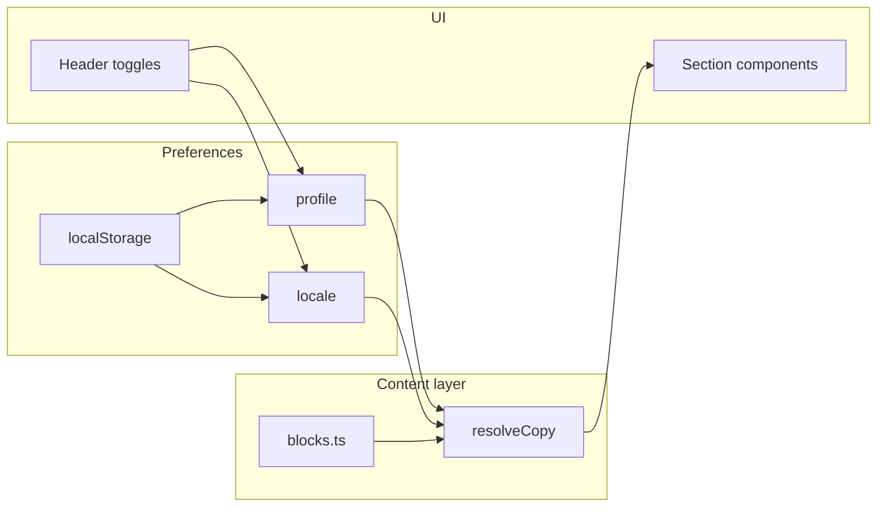

# OmniCore Site — Architecture

Public portfolio portal for OmniCore. Lives at repository root as `site/` (not under `clients/`) because it represents the whole project, not a business client.

**Spec:** [SITE-001](https://www.notion.so/370bd6def30d8165bbc2d5a4f0c62708)  
**Copy source:** [content-copy-matrix.md](./content-copy-matrix.md)  
**Visual source:** Nicola's professional portfolio (`NR/`) and [visual-direction.md](./visual-direction.md)

---

## Goals

- Present OmniCore as a system-shaped portfolio, not a generic landing page.
- Extend Nicola's existing portfolio identity instead of creating a disconnected product site.
- Adapt narrative depth by reader profile without blocking navigation.
- Support ES/EN with persisted preferences.
- Deploy as static site to GitHub Pages.
- Keep content data-driven so copy updates do not require layout rewrites.

## Non-goals (initial phases)

- SSR or backend for the site.
- CMS integration (Notion remains authoring for specs; site copy lives in repo).
- Auth or analytics (can be added later).

---

## High-level structure

```text
site/
├── docs/                          # Specs & copy (this folder, pre-scaffold)
│   ├── architecture.md
│   ├── content-copy-matrix.md
│   └── visual-direction.md
├── public/                        # SITE-002: favicon, og-image, static assets
├── src/
│   ├── main.tsx
│   ├── App.tsx
│   ├── index.css                  # Global tokens (can align with clients/web palette)
│   ├── content/
│   │   ├── types.ts               # Profile, Locale, ContentBlock
│   │   ├── blocks.ts              # Generated/maintained from copy matrix
│   │   └── resolveCopy.ts         # getCopy(id, profile, locale)
│   ├── context/
│   │   └── SitePreferences.tsx    # profile + locale + localStorage
│   ├── components/
│   │   ├── layout/
│   │   │   ├── Header.tsx         # logo, nav, profile toggle, locale toggle
│   │   │   └── Footer.tsx
│   │   ├── controls/
│   │   │   ├── ProfileToggle.tsx
│   │   │   └── LocaleToggle.tsx
│   │   └── sections/
│   │       ├── HeroSection.tsx
│   │       ├── MotivationSection.tsx
│   │       ├── WhatIsSection.tsx
│   │       ├── PrinciplesSection.tsx
│   │       ├── SystemMapSection.tsx
│   │       ├── WorkflowSection.tsx
│   │       ├── DecisionsSection.tsx
│   │       ├── EvidenceSection.tsx
│   │       ├── RoadmapSection.tsx
│   │       └── ClosingSection.tsx
│   └── hooks/
│       └── useCopy.ts             # wraps resolveCopy + preferences
├── index.html
├── package.json
├── tsconfig.json
├── vite.config.ts                 # base: '/OmniCore/' for GitHub Pages project site
└── README.md
```

---

## Runtime model



### Profile & locale

```ts
export type Profile = 'recruiter' | 'developer' | 'executive';
export type Locale = 'es' | 'en';

export type LocalizedCopy = Record<Locale, string>;
export type ProfileCopy = Record<Profile, LocalizedCopy>;

export type ContentBlock = {
  id: string;
  section: string;
  copy: ProfileCopy;
};
```

### Resolver

```ts
export function resolveCopy(
  blocks: ContentBlock[],
  id: string,
  profile: Profile,
  locale: Locale,
): string {
  const block = blocks.find((b) => b.id === id);
  if (!block) return '';
  return block.copy[profile][locale];
}
```

Fallback policy (recommended):

1. Requested `profile` + `locale`
2. Same profile, `es` if locale missing
3. `developer` + requested locale (neutral technical default)
4. Empty string + dev console warning in non-production builds

### Preferences context

```ts
type SitePreferences = {
  profile: Profile;
  locale: Locale;
  setProfile: (p: Profile) => void;
  setLocale: (l: Locale) => void;
};

// localStorage keys
const STORAGE_PROFILE = 'omnicore-site-profile';
const STORAGE_LOCALE = 'omnicore-site-locale';
```

Initial locale: `navigator.language` starts with `en` → `en`, else `es`.

Default profile: `developer` (technical neutral); user changes via soft toggle in header.

---

## Section map (journey)

| Section | Component | Content IDs (initial) | SITE spec |
|---------|-----------|------------------------|-----------|
| Hero | `HeroSection` | `hero-*` | SITE-003 |
| Motivation | `MotivationSection` | `motivation-*` | SITE-004 |
| What is OmniCore | `WhatIsSection` | `what-*` | SITE-004 |
| Principles | `PrinciplesSection` | `principles-*`, `principle-*` | SITE-004 |
| System map | `SystemMapSection` | `system-*` | SITE-004 |
| Workflow | `WorkflowSection` | `workflow-*` | SITE-004 |
| Decisions | `DecisionsSection` | `decision-*` cards | SITE-005 |
| Evidence | `EvidenceSection` | links + cards | SITE-005 |
| Roadmap | `RoadmapSection` | `roadmap-*` | SITE-005 |
| Closing | `ClosingSection` | `closing-*` | SITE-005 |

Decisions cards should share a shape:

```ts
type DecisionCard = {
  id: string;
  title: ProfileCopy;
  context: ProfileCopy;
  decision: ProfileCopy;
  tradeoff: ProfileCopy;
  learning: ProfileCopy;
};
```

---

## UI / UX

- **Soft toggle:** Hero always visible; profile and locale switches in sticky header.
- **Single-page scroll** with anchor nav; optional smooth scroll.
- **Visual tone:** editorial, minimal, close to Nicola's portfolio: strong typography, generous whitespace, restrained accents.
- **Do not:** use generic SaaS gradients, dense dashboard cards, stock-product hero illustrations, or inflated marketing copy.
- **Typography:** typography leads the design. Prefer large, direct headings and readable body copy over decorative UI.
- **Color:** use the warm `NR/` palette from [visual-direction.md](./visual-direction.md): `#fdfbf7` background, `#1a1614` foreground, `#6b5e54` muted text, `#d67d3e` accent, `#e8e1d8` borders, peach support surfaces. Use OmniCore system colors only as secondary technical accents.
- **Motion:** subtle only (fade-in on section enter); respect `prefers-reduced-motion`.
- **Responsive:** mobile-first; profile toggle as segmented control or select on narrow screens.

### Editorial layout principles

- Treat the site as a deep case study inside the `NR/` portfolio identity.
- Prefer text-led blocks, columns, dividers, and short reflective sections.
- Use cards only for decisions, evidence, modules, or roadmap items where grouping improves scanning.
- The adaptive profile toggle changes the narrative angle, not the entire layout.
- Every section should answer one of three questions: why this exists, what decision was made, what was learned.

---

## GitHub Pages

- Build: `npm run build` → `site/dist`
- Workflow: `.github/workflows/site-pages.yml` (SITE-002+)
- Path filter: `site/**`, workflow file
- `vite.config.ts`:

```ts
export default defineConfig({
  base: '/OmniCore/', // match GitHub repo name; confirm org/user Pages URL
  // ...
});
```

- Labels: `site`, `docs`, `infra`

---

## CI (future)

| Workflow | Trigger paths | Steps |
|----------|---------------|--------|
| `site-ci.yml` | `site/**` | `npm ci`, `npm run lint`, `npm run build` |
| `site-pages.yml` | `site/**` on `main` | build + deploy Pages |

Do not run `catalog-service-ci` for site-only PRs.

---

## Relationship to other modules

| Module | Role on site |
|--------|----------------|
| `catalog-service` | System map card, evidence link |
| `clients/web` | Backoffice card; screenshot when available |
| Root `README.md` | Engineering workflow summary |
| Notion Site Specs | Planning; link selected public specs if needed |

---

## Implementation sequence

1. **SITE-001** (done) — journey, audiences, copy matrix draft, architecture doc.
2. **SITE-002** — Vite scaffold, `base` for Pages, minimal `App`, `site/README.md`.
3. **SITE-003** — `SitePreferences`, `resolveCopy`, Hero + header toggles.
4. **SITE-004** — Motivation, What, Principles, System, Workflow sections + copy.
5. **SITE-005** — Decisions, Evidence, Roadmap, Closing + Pages deploy workflow.

---

## Branch naming

```text
feature/SITE-002-site-vite-scaffold
feature/SITE-003-profile-locale-hero
```

Commits include spec ID: `SITE-002 Add Vite scaffold for public site`.
